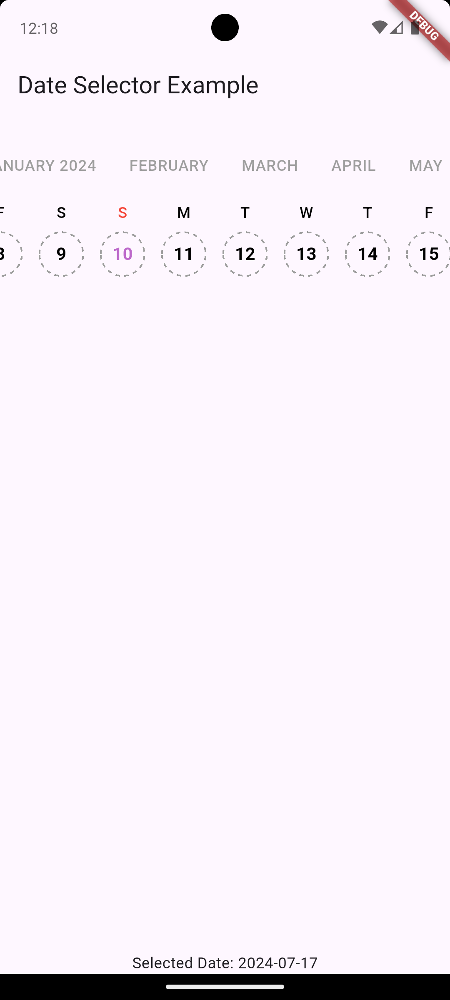
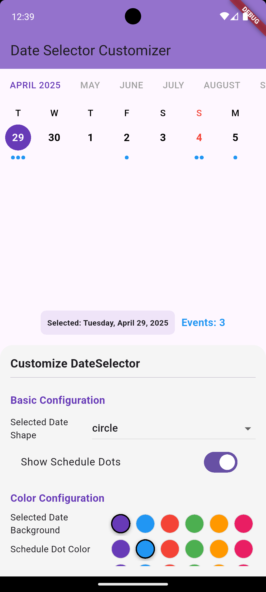
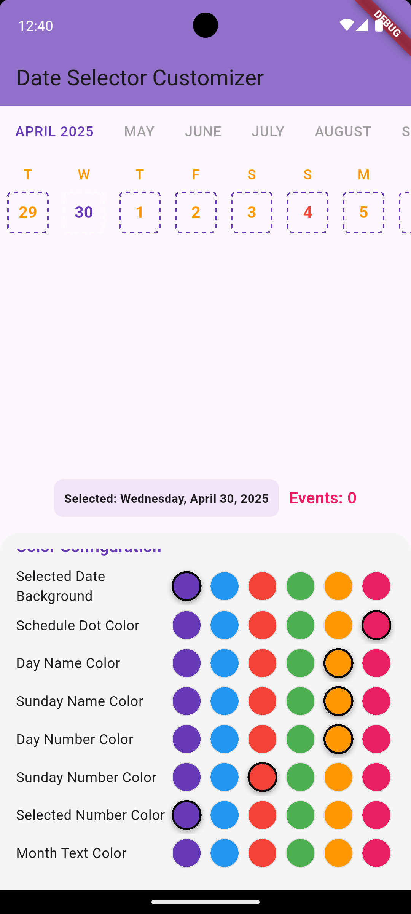

# timeline_date_picker

A beautiful and customizable **horizontal scrollable date picker** for Flutter.  
Supports **custom styling**, **dots to represent events/schedules**, and more!

> Easily scroll through dates horizontally, customize colors, shapes, fonts, and highlight specific dates with schedule dots!

---

## ✨ Features

- Horizontal scrolling date picker.
- Show dots under specific dates (e.g., for events, tasks).
- Customize colors, font sizes, and selected date styles.
- Easily configurable selected date shape: **circle** or **rounded rectangle**.
- Supports **month labels** and **dynamic updates**.
- Built with `scrollable_positioned_list` for smooth performance.

---

## 📸 Screenshots

| Basic Picker | Schedule Dots | Custom Styling |
|:------------:|:-------------:|:--------------:|
|  |  |  |

---

## 🚀 Getting Started

### 1. Install

Add to your `pubspec.yaml`:

```yaml
dependencies:
  timeline_date_picker: ^0.0.1
```

Then run:

```bash
flutter pub get
```

---

### 2. Import

```dart
import 'package:timeline_date_picker/timeline_date_picker.dart';
```

---

### 3. Basic Usage

```dart
DateScroller(
  initialDate: DateTime.now(),
  lastDate: DateTime.now().add(const Duration(days: 365)),
  selectedDate: DateTime.now(),
  onDateSelected: (date) {
    // Handle date selection
  },
)
```

---

## 🛠 Full Example

```dart
DateScroller(
  initialDate: DateTime.now(),
  lastDate: DateTime.now().add(const Duration(days: 365)),
  selectedDate: selectedDate,
  onDateSelected: (date) {
    setState(() {
      selectedDate = date;
    });
  },
  showScheduleDots: true,
  scheduleCounts: {
    DateTime(2025, 4, 29): 3,
    DateTime(2025, 4, 30): 1,
  },
  selectedShape: DateSelectedShape.circle,
  selectedDateBackgroundColor: Colors.deepPurple,
  dayNameColor: Colors.black,
  dayNameSundayColor: Colors.red,
  dayNumberColor: Colors.black,
  dayNumberSundayColor: Colors.red,
  dayNumberSelectedColor: Colors.white,
  scheduleDotColor: Colors.blue,
  monthTextColor: Colors.grey,
  activeMonthTextColor: Colors.deepPurple,
  dayNameTextStyle: const TextStyle(fontSize: 14, fontWeight: FontWeight.w500),
  dayNumberTextStyle: const TextStyle(fontSize: 16, fontWeight: FontWeight.bold),
  monthTextStyle: const TextStyle(fontSize: 14, fontWeight: FontWeight.w500),
)
```

---

## ⚙️ Parameters

| Parameter | Type | Description |
| :--- | :--- | :--- |
| `initialDate` | `DateTime` | Starting date of the picker |
| `lastDate` | `DateTime` | Last selectable date |
| `selectedDate` | `DateTime` | Currently selected date |
| `onDateSelected` | `Function(DateTime)` | Callback when user selects a date |
| `scheduleCounts` | `Map<DateTime, int>` | Optional. Map of dates with event counts (dots) |
| `showScheduleDots` | `bool` | Show or hide dots below dates |
| `selectedShape` | `DateSelectedShape` | Shape of the selected date (circle or rounded rectangle) |
| `selectedDateBackgroundColor` | `Color` | Background color for selected date |
| `dayNameColor` | `Color` | Color of weekday names |
| `dayNameSundayColor` | `Color` | Color of Sunday name |
| `dayNumberColor` | `Color` | Color of day numbers |
| `dayNumberSundayColor` | `Color` | Color of Sundays' numbers |
| `dayNumberSelectedColor` | `Color` | Color of selected date number |
| `scheduleDotColor` | `Color` | Color of schedule dots |
| `monthTextColor` | `Color` | Color of month labels |
| `activeMonthTextColor` | `Color` | Color of currently active month label |
| `dayNameTextStyle` | `TextStyle` | Text style for day names |
| `dayNumberTextStyle` | `TextStyle` | Text style for day numbers |
| `monthTextStyle` | `TextStyle` | Text style for month text |

---

## 📅 Schedule Dots

You can highlight dates with dots by providing a `Map<DateTime, int>` to the `scheduleCounts` parameter.

Each entry corresponds to the number of dots shown under a date.

```dart
scheduleCounts: {
  DateTime(2025, 4, 29): 3,
  DateTime(2025, 4, 30): 1,
}
```

---

## 📦 Example App

Check the [example/](example/) folder for a complete demo on how to customize **Timeline Date Picker**!

---

## 📄 License

This project is licensed under the [MIT License](LICENSE).

---

## 🌟 Like and Star this repo if you find it useful
